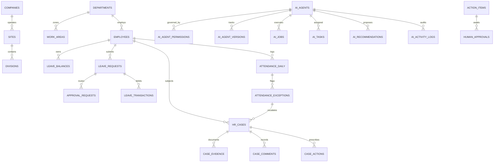

# CosmeFlow People V1 — Complete Database Schema & ERD

## 8-Layer Architecture Specification (PostgreSQL on Supabase)

---

## 1. Schema Architecture Overview

---

## 2. Table Catalog by Layer

### Layer 1: System of Record (Core HR & Employment)
| Table | Description | Primary Key | Key Foreign Keys |
| :--- | :--- | :---: | :--- |
| `companies` | Corporate entity record | `id` (UUID) | - |
| `sites` | Physical factory facilities (Cosmediva Site) | `id` (UUID) | `company_id` |
| `departments` | Organizational units (17 factory departments) | `id` (UUID) | `division_id` |
| `work_areas` | Specific shop-floor zones (Mixing, Filling, Packing, QC) | `id` (UUID) | `department_id` |
| `positions` | Job titles and standard competency tiers | `id` (UUID) | `department_id` |
| `employees` | Single source of truth for 134+ factory personnel | `id` (UUID) | `department_id`, `work_area_id`, `supervisor_id` |
| `employment_history` | Career promotions, transfers, and status changes | `id` (UUID) | `employee_id` |
| `work_schedules` | Office and factory shift definitions | `id` (UUID) | - |
| `shifts` | Daily time intervals (08:00–17:00, Overtime shifts) | `id` (UUID) | `schedule_id` |
| `holiday_calendar` | 16 annual official factory holidays | `id` (UUID) | - |
| `leave_types` | Leave classifications (Annual, Sick, Business, Maternity) | `id` (UUID) | - |
| `leave_policies` | Dynamic rules (notice days, accruals, carry-over) | `id` (UUID) | `leave_type_id` |
| `leave_balances` | Time account balances (entitled, taken, pending, available) | `id` (UUID) | `employee_id`, `leave_type_id` |
| `leave_transactions` | Append-only ledger of all balance credits & debits | `id` (UUID) | `employee_id`, `leave_type_id` |

---

### Layer 2: Workflow Engine
| Table | Description | Primary Key | Key Foreign Keys |
| :--- | :--- | :---: | :--- |
| `leave_requests` | Digital leave applications with pre-validation flags | `id` (UUID) | `employee_id`, `leave_type_id` |
| `approval_requests` | Multi-step approval routing instances | `id` (UUID) | `reference_id`, `assigned_approver_id` |
| `approval_logs` | Immutable audit log of approval decisions | `id` (UUID) | `reference_id`, `actor_id` |
| `notifications` | Role and user push alerts | `id` (UUID) | `recipient_id` |

---

### Layer 3: Rule Engine & Attendance Calculations
| Table | Description | Primary Key | Key Foreign Keys |
| :--- | :--- | :---: | :--- |
| `attendance_raw_logs` | Raw punches imported from HIP fingerprint scanners | `id` (UUID) | `employee_id` |
| `attendance_daily` | Processed attendance state (Present, Late, Absent, Missing) | `id` (UUID) | `employee_id`, `shift_id` |
| `attendance_exceptions` | Filtered anomalies for exception-based management | `id` (UUID) | `attendance_daily_id`, `employee_id` |

---

### Layer 4: Case Management (New Addendum)
| Table | Description | Primary Key | Key Foreign Keys |
| :--- | :--- | :---: | :--- |
| `hr_cases` | Trackable incident cases for attendance anomalies & grievances | `id` (UUID) | `employee_id`, `department_id` |
| `case_evidence` | Structured evidence snapshots (punch logs, statements) | `id` (UUID) | `case_id` |
| `case_comments` | Investigation thread and interview notes | `id` (UUID) | `case_id` |
| `case_actions` | Prescribed corrective and disciplinary resolutions | `id` (UUID) | `case_id` |

---

### Layer 5: AI Workforce Registry & Digital Workers (New Addendum)
| Table | Description | Primary Key | Key Foreign Keys |
| :--- | :--- | :---: | :--- |
| `ai_agents` | Digital Worker directory (Identity, Mission, Status) | `id` (UUID) | - |
| `ai_agent_permissions` | Granular Least-Privilege access rights & prohibited flags | `id` (UUID) | `agent_id` |
| `ai_agent_versions` | Versioned agent prompt references for auditability | `id` (UUID) | `agent_id` |
| `ai_jobs` | Scheduled job definitions (Cron expressions, triggers) | `id` (UUID) | `agent_id` |
| `ai_job_runs` | Execution history of scheduled digital worker jobs | `id` (UUID) | `job_id`, `agent_id` |
| `ai_tasks` | Asynchronous task queue for digital worker assignments | `id` (UUID) | `agent_id` |
| `ai_recommendations` | Output recommendations awaiting human review | `id` (UUID) | `agent_id` |

---

### Layer 6 & 7: Human Decision, Execution & Action Items
| Table | Description | Primary Key | Key Foreign Keys |
| :--- | :--- | :---: | :--- |
| `human_approvals` | Explicit human sign-offs required for Level 3 actions | `id` (UUID) | `approver_id` |
| `action_items` | Unified "What Needs Your Attention?" task inbox | `id` (UUID) | `assigned_to_user` |
| `document_drafts` | AI-prepared / human-issued formal notices and certificates | `id` (UUID) | `related_case_id`, `employee_id` |

---

### Layer 8: Audit & Domain Events
| Table | Description | Primary Key | Key Foreign Keys |
| :--- | :--- | :---: | :--- |
| `domain_events` | System-wide event stream for decoupled pub/sub | `id` (UUID) | `entity_id` |
| `ai_activity_logs` | Immutable audit trail of every digital worker operation | `id` (UUID) | `agent_id`, `job_run_id`, `task_id` |

---

## 3. Cross-Module Integration with CosmeFlow OS

The `employees.id` primary key and `work_areas.work_area_code` act as the unifying thread across all modules in CosmeFlow OS:
- **`CosmeFlow People` ➔ `CosmeFlow Planner`**: Scheduled workforce capacity per line matches daily target batch orders.
- **`CosmeFlow People` ➔ `CosmeFlow Production`**: Operator machine qualification checks enforce GMP / ISO 22716 standards before batch mixing and filling.
- **`CosmeFlow People` ➔ `CosmeFlow Costing`**: Direct overtime hours and labor rates are allocated to specific Lots (`JHD-309`, `JHD-318`) for batch contribution margin and profitability calculations.
